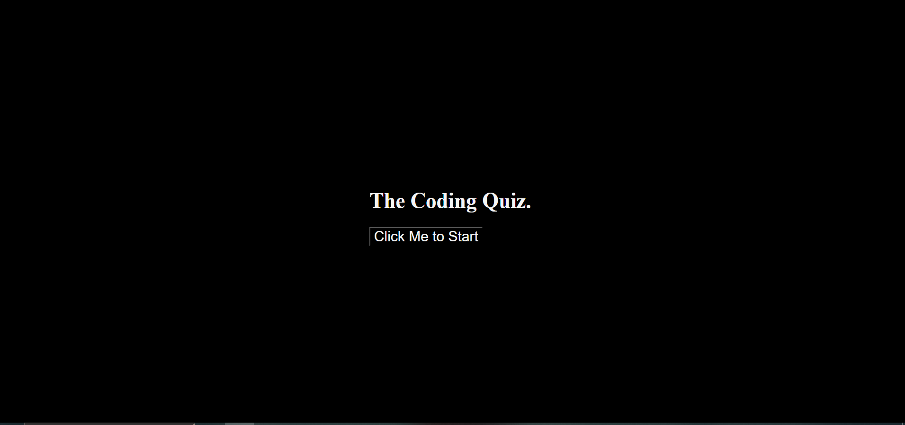
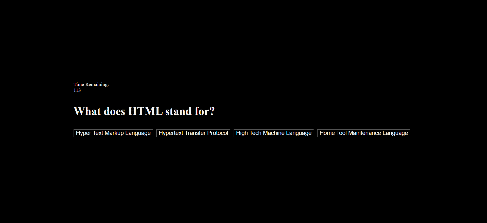

# Quiz_App_Challenge_4

## Screenshot

## Description

For this challenge we were tasked with creating multiple functions in Javascript to create a quiz app that is interactable with users to start the quiz, answer 5 questions, then submit their score in the form of time remaining. This assignment tested our ability to use the new functions in Javascript that we had learned especially involved around manipulating API's.  Some of the tools we used are: creating and manipulating objects, using query selectors, creating HTML elements in Javascript and adding them into the document etc.  The other benefit was using other skills we have used previously such as: for loops, if statements, functions etc. I used many functions in order to accomplish this feat.  The ones I used were: "startFunction" to segway the quiz into a Q&A with a timer, "startTimer" to show the timer and have it call the end function I defined when the timer reached 0, "formatTime" to have the timer actually count down in seconds, "handleChoiceClick" to have the app recognize if the correct answer is clicked to move on to the next question or subtract 10 seconds if the wrong answer is selected, "showQuestion" to actually pull the question variables and choices to generate a paragraph and buttons for the corresponding Q&A, "handleQuizEnd" to wipe the page when the timer ends that signals to the user time is up and add a text editor and button to submit name, "handleNameSubmit" actually take the information or name added by the user and displays it with their time remaining when the quiz finished.

## Installation

N/A

## Usage

The application of this homework assignment is incredibly relevant.  As our first challenge to implement a completely interactable app, this was simple enough to be able to fully understand using Javascript to interact with the user and change the page based on the users inputs.  Finally, the actual use case for this is the ability to create a way to test the users data and display it is immeasurable.   

## Credits

(JD Tadlock)  (RUT-VIRT-FSF-FT-05-2023-U-LOLC)

## License

MIT License

Copyright (c) 2023 matthewlazarowitz

Permission is hereby granted, free of charge, to any person obtaining a copy
of this software and associated documentation files (the "Software"), to deal
in the Software without restriction, including without limitation the rights
to use, copy, modify, merge, publish, distribute, sublicense, and/or sell
copies of the Software, and to permit persons to whom the Software is
furnished to do so, subject to the following conditions:

The above copyright notice and this permission notice shall be included in all
copies or substantial portions of the Software.

THE SOFTWARE IS PROVIDED "AS IS", WITHOUT WARRANTY OF ANY KIND, EXPRESS OR
IMPLIED, INCLUDING BUT NOT LIMITED TO THE WARRANTIES OF MERCHANTABILITY,
FITNESS FOR A PARTICULAR PURPOSE AND NONINFRINGEMENT. IN NO EVENT SHALL THE
AUTHORS OR COPYRIGHT HOLDERS BE LIABLE FOR ANY CLAIM, DAMAGES OR OTHER
LIABILITY, WHETHER IN AN ACTION OF CONTRACT, TORT OR OTHERWISE, ARISING FROM,
OUT OF OR IN CONNECTION WITH THE SOFTWARE OR THE USE OR OTHER DEALINGS IN THE
SOFTWARE.

